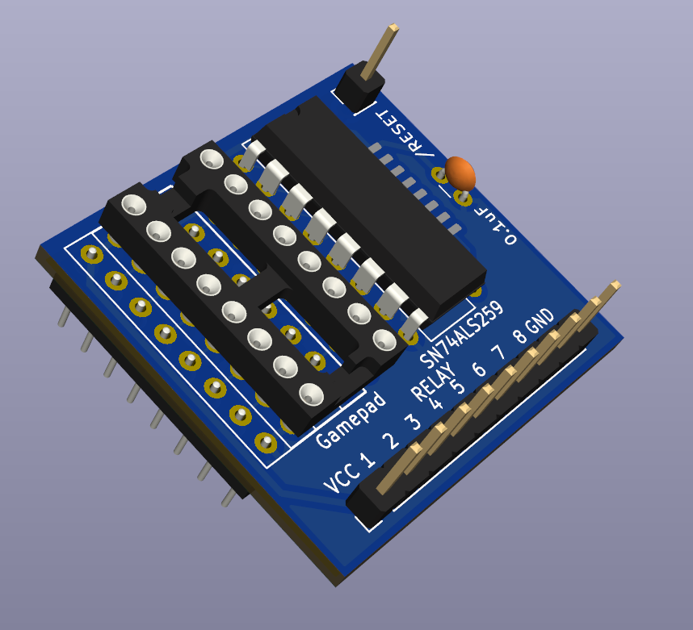

> [!WARNING]
> This design is currently untested as of 5/26/2026. There may be errors in the design or example code.
> 
> Update 6/12/2026: Because the 74_259 resets to all outputs low and the relay module is active low, all the relays default to being on at startup.\
> Adding a 74_240 inline between the 74_259 and relay board will correct for this in a future revision.\
> Schematics and Gerbers for an "OOPS! Inverter" board will be uploaded soon.

> [!CAUTION]
> It is advisable to remove the VCC jumper on the relay board and power the relays with the GND and JD-VCC pin.
> The game port is designed to provide a maximum of 100ma, and with all relays turned on more than 500ma load will be present.

# Apple II Gameport Relay Interface



This is a design for a small PCB to control inexpensive [8-relay modules](https://amzn.to/4dw5lLv) <sup>(Amazon affiliate link)</sup> using the Apple II's gameport annunciators and strobe output.
Use AN3 to set on/off state, AN0-AN2 to select which relay to control, and $C040 strobe to store the value.
All pins are passed through to a socket where you can attach a gamepad, paddles, or other input device.

# Applesoft BASIC Example
```
10 REM To turn on the first relay:
20 PEEK -16295 : REM Clear AN0 $C059
30 PEEK -16293 : REM Clear AN1 $C05B
40 PEEK -16291 : REM Clear AN2 $C05D
50 PEEK -16290 : REM  Set  AN3 $C05E
60 PEEK -16320 : REM Strobe    $C040
```

# 6502 ASM Example
```
0300  lda $C059 ; Clear AN0
0303  lda $C05B ; Clear AN1
0306  lda $C05D ; Clear AN2
0309  lda $C05E ;  Set  AN3
030c  lda $C040 ; Strobe
030f  rts
```
